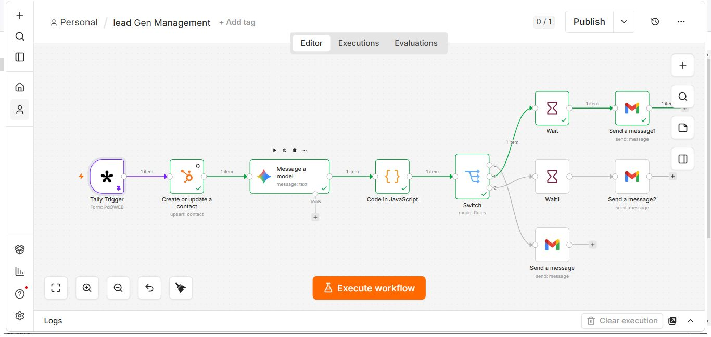

# AI Lead Qualification & Automated Follow-Up

An n8n workflow that captures new enquiries, updates HubSpot, uses Gemini AI to assess lead quality, and routes leads into automated Hot, Warm, or Cold follow-up paths.

## Workflow



The workflow shown above demonstrates the end-to-end routing from enquiry capture through AI analysis, lead classification, and automated follow-up.

## What it does

- Captures new enquiries through Tally
- Creates or updates contacts in HubSpot
- Uses Gemini AI to analyze lead information such as budget and urgency
- Classifies leads as Hot, Warm, or Cold
- Sends immediate alerts for Hot leads
- Sends scheduled follow-ups for Warm leads
- Places Cold leads into a nurture path
- Reduces manual CRM updates and repetitive follow-up work

## Workflow architecture

```
Tally
  ↓
HubSpot: Create or Update Contact
  ↓
Gemini AI: Lead Analysis
  ↓
JavaScript: Parse AI Output
  ↓
Switch: Hot / Warm / Cold
  ├── Hot  → Immediate Gmail notification
  ├── Warm → Wait → Follow-up email
  └── Cold → Nurture email path
```

## Tech stack

- n8n
- Tally
- HubSpot
- Google Gemini
- JavaScript
- Gmail

## Repository structure

```
workflow/
  lead-qualification.json

screenshots/
  ai-lead-qualification-n8n.png

docs/
  architecture.md

SECURITY.md
```

## Public workflow

The workflow JSON in this repository is sanitized for portfolio sharing. Credentials, webhook identifiers, internal workflow metadata, and private connection details have been removed or replaced with placeholders.

## Why this automation matters

Lead enquiries can require several manual steps before a sales team can act on them. This workflow connects those steps so incoming leads can be captured, enriched, classified, and routed automatically.

The Hot, Warm, and Cold paths demonstrate how different lead priorities can trigger different follow-up actions without requiring every enquiry to be handled manually.

## About

Built as a portfolio example of AI and workflow automation for lead management, CRM operations, and sales follow-up.

More automation work:

- Portfolio: https://ojo-israel-portfolio.lovable.app
- LinkedIn: https://www.linkedin.com/in/ojo-israel-ai-and-workflow-automation

---

**Built by Ojo Israel — AI & Workflow Automation Specialist**
